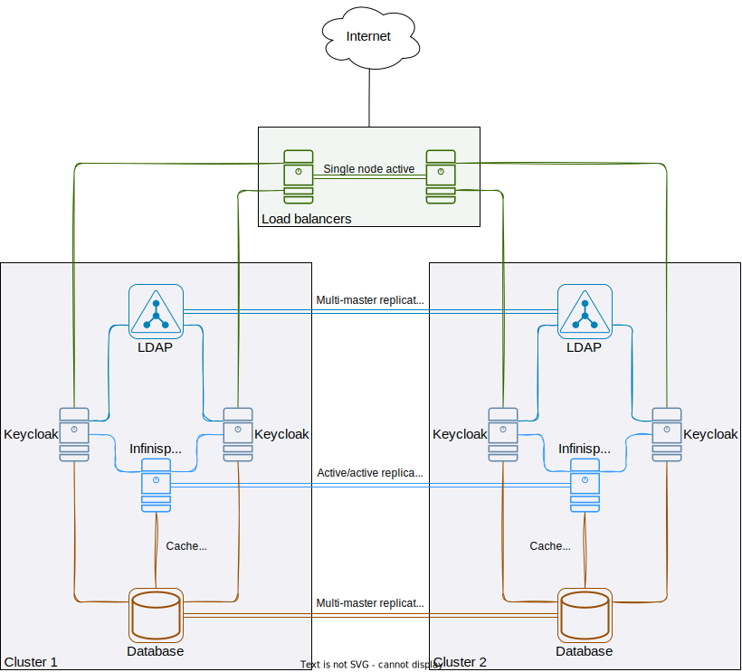

## Keycloak deployment with cross-datacenter replication using Ansible

This repository contains a list of playbooks that can be used to deploy a
Keycloak cluster natively. The deployment has been tested using an architecture
similar to the one described in the WildFly-based (now deprecated) distribution
of Keycloak [installation guide][].

> **Note**
> The configuration has been tested and works on RedHat-based distributions
> (Centos Stream 8+). The playbooks are compatible with Ansible 2.9+.
>
> Because the HAProxy version that is available in the Centos Stream 8
> repositories is 1.8, it will fail to start. Centos Stream 9 and Fedora 36 can
> use HAProxy version 2.4, so the configuration should work properly for either. 

The figure below shows an overview of the architecture. It is composed of a
cluster of load balancer servers (running either nginx or HAProxy), and one
or more clusters with Keycloak, Infinispan, database (MariaDB), and LDAP
servers. The links between the servers are logical only, and are meant to
highlight how services are connected.

Requests from users are passed through load balancers that will forward them to
the keycloak servers in both datacenters. The load balancers must be able to
handle TLS when communicating with the users, and also offer support for [sticky
sessions][] to make a user's requests are always handled by the same keycloak
servers.




### Notes and warnings

> **Warning**
> The playbooks create firewall rules that may move the server's interfaces to
> different zones to allow connections only on the service ports, and that are
> coming from expected sources.

> **Warning**
> The playbooks install all services and update core configuration files /
> settings for each service. As such, it is **strongly** recommended to deploy
> the services on fresh systems (e.g, virtual machines).

The LDAP servers can be omitted, as they are not required for any of the other
services inside the playbooks. The other services inside each cluster (Keycloak,
Infinispan, database) are required, however, since Keycloak's functionality is
strictly tied to them.

More than one load balancer server can be configured, but the playbooks
currently do not configure any high availability mechanism. Most importantly,
this means that any of the load balancers can receive requests and process them
if they can be reached, but virtual IPs are not migrated automatically.

All services (except LDAP, which is not configured to use the proper
certificate, should be added in the future) have SSL enabled. The playbooks
generate self-signed certificates on one of the servers in each category
(keycloak, infinispan, and so on), replicates the files on all other services in
the same category, and then configures the services to use them. The client
services are then configured to trust the certificates of the services they
connect to.

The playbooks can optionally install Prometheus exporter services on each node
if the `prometheus_servers` variable is defined and contains a list of IPs of
the Prometheus scraper servers.


### Running the playbooks

Before you run the playbooks, make sure you have installed all the requirements
by running the following command on server that will run the playbooks:
```
ansible-galaxy collection install -r requirements.yml
```

You can prepare your infrastructure however you prefer; example Openstack
stack templates with either one or two Keycloak clusters can be found in the
`examples` directory.


#### Setting up the inventory

The clusters must be defined in an inventory file similar to the ones in the
`examples` directory. You should be able to add however many hosts in any of the
groups, but make sure to not change the names of the functional groups
(`load_balancers`, `keycloak`, `database`, `infinispan`, `ldap`), since these
are used to identify the nodes that services must communicate with.

The example inventories expect hosts to be defined in the control node's SSH
configuration file. This way you can configure various connection parameters
such as SSH keys and jump hosts for each node. Feel free to set up communication
parameters in any way you prefer.

> **Warning**
> If you intend to add a new cluster to the inventory, make sure to also create
> a group variable file as `group_vars/cluster_num`. The file must contain the
> name of the cluster and an index number. These parameters are used to set up
> Keycloak clusters and LDAP replication, so setting them is mandatory. The
> group's name **must** start with `cluster_`


#### Creating a vault file

This project requires having a vault file named `group_vars/vault`. You must
encrypt the file using `ansible-vault`. The structure of the file, and a short
description about each entry can be found in the `examples/group_vars/vault`
file. The entries under `user` keys will usually have an username as a child key
that in turn contains an additional `pass` key with a user's password as the
value. LDAP is the exception to this rule, since bind DNs (which have a similar
meaning to usernames) have a more lengthy structure.

You must update the passwords inside the vault to the passwords you will use. To
create and encrypt a vault you must use the following command and paste the
contents you want encrypted (a dictionary as shown in the example file) inside
the editor that opens:
```
ansible-vault create group_vars/vault
```

To generate random passwords you can use any password script or command you
see fit. A simple and somewhat safe command would be
`cat /dev/urandom | tr -dc '[:alnum:]' | head -c 40` to create a 40-characters
long random password containing alphanumeric characters. If you want the
password to also contain other characters, you can add them explicitly, or
replace `:alnum:` with `:graph:` or `:print:`, depending on your needs.

We recommend using long (40-50 characters long), alphanumeric passwords to avoid
problems with special characters in some scripts.


#### Common variable overrides

You will need to set some of the following variables for your deployment
(depending on your needs, but not limited to these):
  - `keycloak_path_prefix`: Prefix added to Keycloak paths on the web interface.
    The default value is `/auth`;
  - `pki_country_name`: Country name used in certificates;
  - `pki_organization_name`: Organization name used in certificates;
  - `pki_locality_name`: Locality name used in certificates;
  - `pki_dhparams`: A predefined pair of Diffie-Hellman parameters to copy to
    the servers, since DH parameter generation can take a long time (tens of
    minutes, up to hours);
  - `service_hostname_dns`: DNS name that can be used to reach the load
    balancers. Value must be a valid DNS name, as `DNS:` is prepended before
    the name as part of the Subject Alternative Name field during certificate
    generation);
  - `access_admin_allowed_sources`: List of IPs that the admin console can be
    reached from. The values must be IPs since the load balancer may not
    resolve names;
  - `access_admin_realm_allowed_sources`: Dictionary containing realm names as
    keys and a list of IPs that can reach the realm's admin API realm.
    The values must be IPs since the load balancer may not resolve names.
    Note that the realm names are not verified at all, and the values
    are simply added in the load balancer's;
  - `access_health_allowed_sources`: List of IPs that can access the `health`
    endpoint. Defaults to `acess_admin_allowed_sources`;
  - `access_metrics_allowed_sources`: List of IPs that can access the `metrics`
    endpoint. Defaults to `prometheus_servers`;
  - `prometheus_servers`: List of IPs of Prometheus scraper servers (the
    firewall on each node is configured to allow connections from these IPs to
    the Prometheus exporter services). The exporters are only installed if at
    least one IP is listed here;
  - `keycloak_custom_theme`: If a custom theme for keycloak must be installed,
    it can be configured to be downloaded from a git repository. The following
    keys are required:
    - `url`: URL to the git repository that hosts the custom theme;
    - `version`: Version the repository should be set to (e.g. `HEAD`, a branch
      name, a tag name);
    - `name`: The name of the theme, as it will be installed in the `themes`
      directory;
    - `path`: The path to the root of the theme files inside the repository
      (e.g., if the repository contains the theme files in the `theme`
      directory, and the `custom` name is specified as the parameter above,
      the files inside the repository's `theme` directory will be copied to
      Keycloak's `themes/custom` directory);
  - `keycloak_custom_modules`: A list of custom modules to compile and install
    in Keycloak. The modules are compiled using `maven` and the resulting `jar`
    artifact is copied in the `deployments` directory in Keycloak. For each
    custom module you must specify the following paramters:
    - `name`: Name of the custom module; this name will be used to create a
      directory to clone to repository into, so we recommend using dashes
      between words (e.g. `custom-module`);
    - `url`: URL to the git repository that hosts the custom module;
    - `version`: Version the repository should be set to (e.g. `HEAD`, a branch
      name, a tag name);
    - `maven_extra_params`: A list of command line arguments to pass to maven;
      this parameter is optional; if not set, the package is built using
      `maven package`.
  - `keycloak_enabled_features`: A list of keycloak features to enable;
  - `keycloak_disabled_features`: A list of keycloak features to disable;
  - `load_balancer_service`: The type of load balancer to install - either
    `nginx` or `haproxy` can be specified.
  - `rsyslog_log_servers`: A list of rsyslog log servers that can receive log
    data. Each entry in the array must have the following fields:
    - `address`: the address to connect to (IP address recommended);
    - `proto`: protocol to use for communication - accepted values are either
      `tcp` or `udp`. Defaults to `udp`;
    - `port`: port to use when connecting to the log server. Defaults to 514;
    - `cert_cn`: server's common name, if TLS communication is used.
  - `rsyslog_log_server_ca_certificate`: The certificate of the certification
    authority used to sign the log servers' certificates, in PEM format.
    Note: This variable is used to determine if TLS should be enabled -
    TLS cannot be used if unset.
  - `firewall_custom_port_rules` and `firewall_custom_rich_rules`: Add
    "non-standard" configurations for allowed ports and rich rules. If you
    intend to permanently enable ports or add rich rules, use these variables to
    add them since the firewall role removes unexpected ports and rich rules.
    Refer to the `firewall_port_rules` and `firewall_rich_rules` variables in
    `roles/firewall/defaults/main.yml` for examples. Both variables are
    dictionaries, where the keys are **group names** (the names must match a
    group name from the `group_names` special variable of a host, or `"all"`),
    and the values are lists containing the configurations for hosts in the
    group.

The override variables can be specified inside a YAML file that you will include
when running the playbooks. An example of an overrides file can be found in the
`examples` directory.


#### Executing the playbook

You can run the playbooks using the following command:
```
ansible-playbook -i inventory.yml main.yml --ask-vault-pass -e '@overrides.yml'
```


### Changelog

A changelog describing the most important changes starting December 2022 is
available in the [CHANGELOG](CHANGELOG.md) file. Note that the changelog does
not cover every single change (i.e., it does not include bug fixes), but broader
changes that may alter system and service behaviour.


### Credits

This repository is a rewrite of an older private repository. Parts of the
original playbooks for the database and Prometheus exporters were contributed by
@dandrei279.


[installation guide]: https://www.keycloak.org/docs/15.1/server_installation/#crossdc-mode
[sticky sessions]: https://www.keycloak.org/docs/15.1/server_installation/#sticky-sessions
